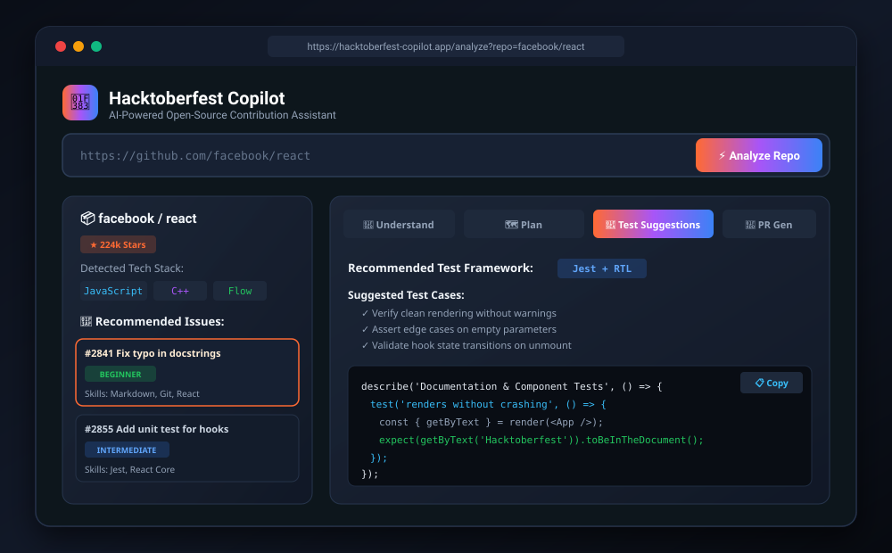

<p align="center">
  
</p>

<h1 align="center">🎃 Hacktoberfest Copilot</h1>

<p align="center">
  <strong>AI-Powered Open-Source Contribution Assistant</strong>
</p>

<p align="center">
  <a href="https://github.com/AsmitAnand/HacktoberFest-Team-GrandCoders/blob/main/LICENSE">
    
  </a>
  <a href="https://github.com/AsmitAnand/HacktoberFest-Team-GrandCoders/issues">
    
  </a>
  <a href="https://github.com/AsmitAnand/HacktoberFest-Team-GrandCoders/pulls">
    
  </a>
  <a href="https://github.com/AsmitAnand/HacktoberFest-Team-GrandCoders/stargazers">
    
  </a>
</p>

<p align="center">
  <em>Turn "I want to contribute to open source" into "I have a plan and I'm ready to submit a PR."</em>
</p>

---

## 🧐 The Problem

Open-source projects rely on community contributions, but many beginners struggle to make their first contribution. They face:

- 🔍 **Discovery overload** — Thousands of issues, no idea which ones match their skill level
- 📖 **Codebase confusion** — Unfamiliar project structures, languages, and conventions
- 🤔 **Analysis paralysis** — Not knowing which files to change or how to approach a fix
- 😰 **PR anxiety** — Unsure how to write a good pull request description

**Result:** Many potential contributors abandon the process before their first PR.

## 💡 The Solution

**Hacktoberfest Copilot** is an AI-powered assistant that guides beginners from **discovering an issue** to **submitting a pull request**.

Paste any GitHub repository URL and the assistant will:

| Feature | Description |
|---------|-------------|
| 🔍 **Issue Discovery** | Identify beginner-friendly issues with difficulty ratings |
| 📊 **Skill Matching** | Categorize issues by required skills and estimated difficulty |
| 🧠 **Plain-Language Explanations** | Rewrite complex issues in beginner-friendly language |
| 📁 **File Mapping** | Identify the exact files and components involved |
| 🛠️ **Step-by-Step Plans** | Generate a detailed implementation plan |
| 🧪 **Test Suggestions** | Recommend appropriate tests for proposed changes |
| 📝 **PR Generation** | Draft a professional pull request description |
| 💡 **Code Explanation** | Explain unfamiliar code and technologies |

## 🎬 Visual Walkthrough & Demo

<p align="center">
  
</p>

```
┌────────────────────────────────────────────────────────────────────────┐
│ 1. LANDING PAGE                                                       │
│    Enter public GitHub repository URL (e.g. facebook/react)           │
│    [ https://github.com/facebook/react                     ] [ Analyze ]│
└───────────────────────────────────┬────────────────────────────────────┘
                                    │
                                    ▼
┌────────────────────────────────────────────────────────────────────────┐
│ 2. REPO DASHBOARD                                                      │
│    Tech Stack: JavaScript, C++, Flow | Good First Issues: 12 Detected  │
│    ┌────────────────────────────────────────────────────────────────┐  │
│    │ Issue #2841: Fix typo in documentation                          │  │
│    │ Difficulty: Beginner | Skills: Markdown, Git                   │  │
│    └──────────────────────────────┬─────────────────────────────────┘  │
└───────────────────────────────────┼────────────────────────────────────┘
                                    │ Click Issue
                                    ▼
┌────────────────────────────────────────────────────────────────────────┐
│ 3. AI GUIDANCE HUB (Gemma 4 Powered)                                  │
│    [🧠 Understand]   [🗺️ Implementation Plan]   [🧪 Tests]   [📝 PR]  │
│    ├─ Plain-English Breakdown & Jargon Explanations                   │
│    ├─ Targeted File Tree & Component Pointers                         │
│    ├─ Step-by-Step Action Roadmap & PR Checklist                      │
│    ├─ Recommended Test Framework & Unit Test Scaffolding              │
│    └─ 1-Click Copy Markdown PR Description Ready for GitHub           │
└────────────────────────────────────────────────────────────────────────┘
```

> 📚 **API Documentation:** Check out our [API Documentation Guide](docs/API.md) and import the [Postman Collection](docs/Hacktoberfest_Copilot.postman_collection.json) to test the backend endpoints directly.

## 🏗️ Architecture

```
┌─────────────────────────────────────────────────────────┐
│                    Next.js Frontend                      │
│  ┌──────────┐  ┌───────────────┐  ┌──────────────────┐  │
│  │ Landing  │  │ Repo Analysis │  │  Issue Detail +   │  │
│  │  Page    │→ │  Dashboard    │→ │  AI Guidance      │  │
│  └──────────┘  └───────────────┘  └──────────────────┘  │
└──────────────────────┬──────────────────────────────────┘
                       │ HTTP/REST
┌──────────────────────▼──────────────────────────────────┐
│                  Python FastAPI Backend                   │
│  ┌──────────────┐  ┌──────────────┐  ┌──────────────┐   │
│  │ GitHub API   │  │  Gemma 4 AI  │  │  Response     │   │
│  │ Client       │  │  Service     │  │  Cache        │   │
│  └──────┬───────┘  └──────┬───────┘  └──────────────┘   │
└─────────┼─────────────────┼─────────────────────────────┘
          │                 │
    ┌─────▼─────┐    ┌──────▼───────┐
    │ GitHub    │    │ Google AI    │
    │ REST API  │    │ Studio       │
    └───────────┘    │ (Gemma 4)   │
                     └──────────────┘
```

## 🛠️ Tech Stack

| Layer | Technology |
|-------|-----------|
| **Frontend** | Next.js 14, React 18, CSS Modules |
| **Backend** | Python 3.11+, FastAPI, Uvicorn |
| **AI Engine** | Google AI Studio (Gemma 4) via `google-generativeai` SDK |
| **APIs** | GitHub REST API v3 |
| **DevOps** | Docker, GitHub Actions CI/CD |
| **Deployment** | Vercel (frontend) + Railway/Render (backend) |

## 🚀 Getting Started

### Prerequisites

- **Node.js** 18+ and **npm** 9+
- **Python** 3.11+
- **Git**
- **GitHub Personal Access Token** — [Create one here](https://github.com/settings/tokens)
- **Google AI Studio API Key** — [Get one here](https://aistudio.google.com)

### 1. Clone the Repository

```bash
git clone https://github.com/AsmitAnand/HacktoberFest-Team-GrandCoders.git
cd HacktoberFest-Team-GrandCoders
```

### 2. Set Up the Backend

```bash
cd backend
python -m venv venv

# Windows
venv\Scripts\activate
# macOS/Linux
source venv/bin/activate

pip install -r requirements.txt

# Create .env file
cp .env.example .env
# Edit .env and add your API keys

# Start the backend
uvicorn app.main:app --reload --port 8000
```

### 3. Set Up the Frontend

```bash
cd frontend
npm install

# Create .env.local file
cp .env.example .env.local

# Start the frontend
npm run dev
```

### 4. Open the App

Visit [http://localhost:3000](http://localhost:3000) in your browser.

### Docker (Alternative)

```bash
# From the project root
docker-compose up --build
```

## 📁 Project Structure

```
HacktoberFest-Team-GrandCoders/
├── frontend/                  # Next.js application
│   ├── app/                   # App Router pages
│   │   ├── layout.js          # Root layout
│   │   ├── page.js            # Landing page
│   │   ├── globals.css        # Design system
│   │   ├── analyze/           # Repo analysis page
│   │   └── issue/[id]/        # Issue detail page
│   ├── components/            # Reusable UI components
│   ├── lib/                   # Utilities & API client
│   └── public/                # Static assets
├── backend/                   # FastAPI application
│   ├── app/
│   │   ├── main.py            # App entry point
│   │   ├── config.py          # Environment config
│   │   ├── routers/           # API route handlers
│   │   ├── services/          # Business logic
│   │   ├── models/            # Pydantic schemas
│   │   └── prompts/           # AI prompt templates
│   ├── tests/                 # Backend tests
│   └── requirements.txt       # Python dependencies
├── .github/
│   └── workflows/
│       └── ci.yml             # CI/CD pipeline
├── docker-compose.yml         # Local dev environment
├── CONTRIBUTING.md            # Contribution guidelines
├── CODE_OF_CONDUCT.md         # Community standards
├── LICENSE                    # MIT License
└── README.md                  # This file
```

## 🤝 Contributing

We welcome contributions! Please read our [Contributing Guidelines](CONTRIBUTING.md) and [Code of Conduct](CODE_OF_CONDUCT.md) before getting started.

### Quick Start for Contributors

1. Fork the repository
2. Create a feature branch: `git checkout -b feat/your-feature`
3. Commit your changes: `git commit -m "feat: add your feature (#issue-number)"`
4. Push to your branch: `git push origin feat/your-feature`
5. Open a Pull Request

See [CONTRIBUTING.md](CONTRIBUTING.md) for detailed instructions.

## 👥 Team GrandCoders

| Name | Role | College | GitHub | Email |
|------|------|---------|--------|-------|
| **Asmit Anand** | Lead & Backend | Manipal University Jaipur | [@AsmitAnand](https://github.com/AsmitAnand) | asmitanand2006@gmail.com |
| **Kartikeya Sorout** | Frontend Lead | Manipal University Jaipur | [@KartikeyaSorout](https://github.com/KartikeyaSorout) | kartikeyasorout@gmail.com |
| **Khushhal Kumar Bansal** | Full-Stack & DevOps | Manipal University Jaipur | [@Khushhalbansal](https://github.com/Khushhalbansal) | khushhalbansalb2@gmail.com |


## 📄 License

This project is licensed under the MIT License — see the [LICENSE](LICENSE) file for details.

## 🙏 Acknowledgments

- [Hacktoberfest](https://hacktoberfest.com/) for inspiring open-source contributions
- [Google AI Studio](https://aistudio.google.com/) for providing access to Gemma 4
- [GitHub REST API](https://docs.github.com/en/rest) for repository data
- All open-source maintainers who make contribution accessible

---

<p align="center">
  Made with ❤️ by Team GrandCoders for Hacktoberfest 2026
</p>
